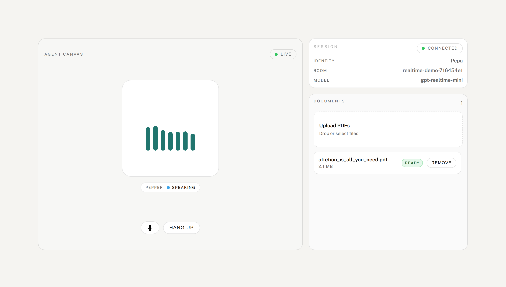

# Voice Agent Demo

Showcase of a LiveKit voice agent with a function tool that searches a vector database (RAG). You can try the hosted demo at:

```
https://navarlu.github.io/voice-agent/
```

Enter the passcode when prompted (contact `navarlu2@fel.cvut.cz` to get it). This guide covers running everything locally.

## Screenshot



## Architecture

- `docs/` → Local static UI (WebRTC via LiveKit JS)
- `token_server/` → FastAPI service that mints LiveKit tokens
- `agent/` → LiveKit agent process (LLM/STT/TTS)
- LiveKit server → local Docker services (LiveKit + Redis + Weaviate)

## Setup

### 1) Clone the repo

```
git clone https://github.com/navarlu/voice-agent.git
cd voice-agent
```

### 2) Local LiveKit and Weaviate (Docker)

For local dev, spin up LiveKit + Redis + Weaviate:

```
docker compose \
  --env-file .env \
  -f local/docker-compose.yml up -d
```

### 3) Python env + deps (single venv, single requirements)

Keep one virtualenv at repo root (ignored by git) and install a single shared requirements file:

```
uv venv
uv pip install -r requirements.txt
```

### 4) Run token server

```
uv run uvicorn token_server.token_service:app --host 0.0.0.0 --port 8001
```

### 5) Run the voice agent

In another shell (same virtualenv):

```
uv run python agent/voice_agent.py
```

The agent will join LiveKit and greet the first participant.

### 6) Run local static UI server

Serve the static UI locally:

```
uv run python -m http.server 5500 --directory docs
```

Open the UI in your browser:

```
http://localhost:5500/?env=local
```

### 7) Local UI toggle

The UI auto-switches to local endpoints on `localhost`. You can also force it:

- `?env=local` → uses `http://localhost:8001/token`

### 8) Shared env file

Create a single `.env` in the repo root (next to this README). Both the token server and the agent read from it:

```
LIVEKIT_URL=ws://localhost:7880
LIVEKIT_API_KEY=LK_LOCAL_KEY
LIVEKIT_API_SECRET=LK_LOCAL_SECRET
DEMO_PASSCODE=...
ALLOWED_ORIGINS=http://localhost:5500
ROOM_PREFIX=robbie
OPENAI_API_KEY=...
```

`local/livekit.yaml` contains the matching key/secret. Change both if you prefer your own values.
